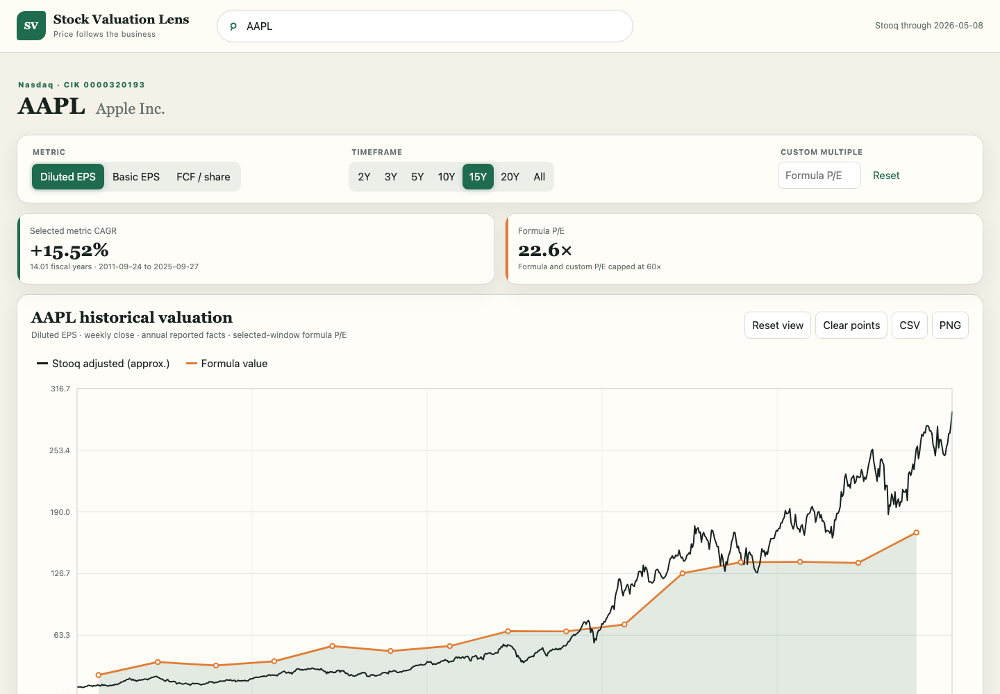

# Stock Valuation Lens

Stock Valuation Lens is a local, dependency-free web application for comparing weekly stock prices with annual reported basic EPS, diluted EPS, and simple free cash flow per share. It builds a compact SQLite database from SEC Company Facts, Stooq, and any curated supplemental files already in this directory; it never changes or deletes those raw files.

## Website example



The application runs entirely on your machine. Search for a company, switch between reported per-share metrics, change the time window, compare market price with the formula reference, and export the visible data as CSV or PNG.

## Repository data policy

Large downloaded and generated data is intentionally excluded from Git. The `.gitignore` keeps `companyfacts/`, `daily/`, `company_tickers_exchange.json`, and `app_data/` local. The small files under `supplemental_data/` and `split_prices.example.csv` are included because they provide a usable example and document the expected input formats.

## What is implemented

- Annual `10-K`/`10-K/A` fact extraction with duration checks, restatement deduplication, retroactive standard-taxonomy stock-split normalization, and SEC tag/accession provenance.
- Basic and diluted EPS from reported facts only.
- Simple FCF = operating cash flow − cash capex, plus FCF/share when diluted weighted-average shares are available.
- Weekly Stooq downsampling, ETF exclusion, ticker/CIK matching, freshness metadata, and a JSON import audit.
- Curated non-SEC issuer support with local market-price and annual-report provenance. The included `MC.PA` record covers LVMH on Euronext Paris in EUR.
- Formula reference value using `P/E = min(60, 15 × ((1 + CAGR) / 1.10)^(years × 0.6))` (with CAGR and years from the selected annual observations; the duration weight gives long growth runs partial credit), custom P/E capped at 60, 2–20-year/All ranges, draggable brush, zoom, pan, hover details, and CSV/PNG exports.

The project uses only the Python 3.7+ standard library and SQLite. No package installation or internet connection is needed after the two reference inputs have been obtained.

## Required reference inputs

1. Download the SEC `company_tickers_exchange.json` file in a browser from:

   <https://www.sec.gov/files/company_tickers_exchange.json>

2. To plot split-adjusted closing prices alongside the formula valuation, optionally supply a CSV containing split-adjusted but **not dividend-adjusted** closes:

   ```csv
   ticker,date,close
   AAPL,2025-01-03,243.36
   MSFT,2025-01-03,423.35
   ```

   The CSV may contain daily or weekly rows. The importer retains the last row of each week. This input is optional: without it, Stooq adjusted prices are plotted with an approximation warning.

3. `supplemental_data/companies.json` is optional curated input for issuers outside SEC Company Facts. It contains the company identity, the relative `date,close` price CSV path, and annual reported facts with source metadata. It is loaded by default when present; pass `--supplemental-data` to use another file, or an empty value to omit it.

   The bundled MC.PA dataset contains 25 years of weekly downsampled Euronext-Paris price history (from locally stored daily closes) and LVMH basic Group-share EPS for fiscal years 2015–2025. Prices use Yahoo Finance's historical `close` field, not its dividend-adjusted field. EPS figures are in EUR and cite the relevant LVMH annual reports in the source tooltip.

## Build the database

For all matched Nasdaq, NYSE, and NYSE American stock files:

```sh
python3 build_database.py \
  --sec-tickers /path/to/company_tickers_exchange.json \
  --split-prices /path/to/split_only_prices.csv
```

For a quick validation subset, omit `--split-prices` if necessary and use:

```sh
python3 build_database.py \
  --sec-tickers /path/to/company_tickers_exchange.json \
  --tickers AAPL,MSFT,KO,BRK-B,JPM,MC.PA
```

The defaults produce:

- `app_data/fastfunds.sqlite3` — derived application database.
- `app_data/import_audit.json` — coverage, exclusions, missing facts, malformed files, and price warnings.

Use `--force` to atomically replace an existing derived database. Source files remain untouched. `--max-price-years 25` limits stored weekly prices while retaining a buffer for 20-year charts; use `0` to keep all history.

## Run the app

```sh
python3 run_app.py
```

Open <http://127.0.0.1:8765>. The server binds only to the local loopback interface.

## Test

```sh
python3 -m unittest discover -v
```

The tests use temporary fixtures and do not modify the local SEC or Stooq data.

## Important interpretation notes

- SEC Company Facts generally starts around the 2009 XBRL reporting mandate, so many companies have fewer than 20 annual observations.
- Conventional FCF is often unavailable or not meaningful for banks, REITs, and some foreign filers. Missing metrics are disabled rather than silently synthesized.
- MC.PA currently supplies basic EPS only. Diluted EPS and FCF/share are intentionally disabled until directly sourced from LVMH's audited statements in the required form.
- The orange line is a transparent valuation reference, not an intrinsic-value claim. The blue line requires validated split-only prices.
- This is an independent research interface, not investment advice or an exact reproduction of proprietary FAST Graphs calculations.
